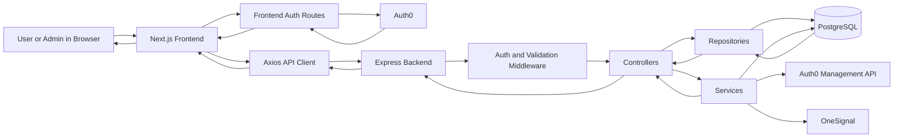
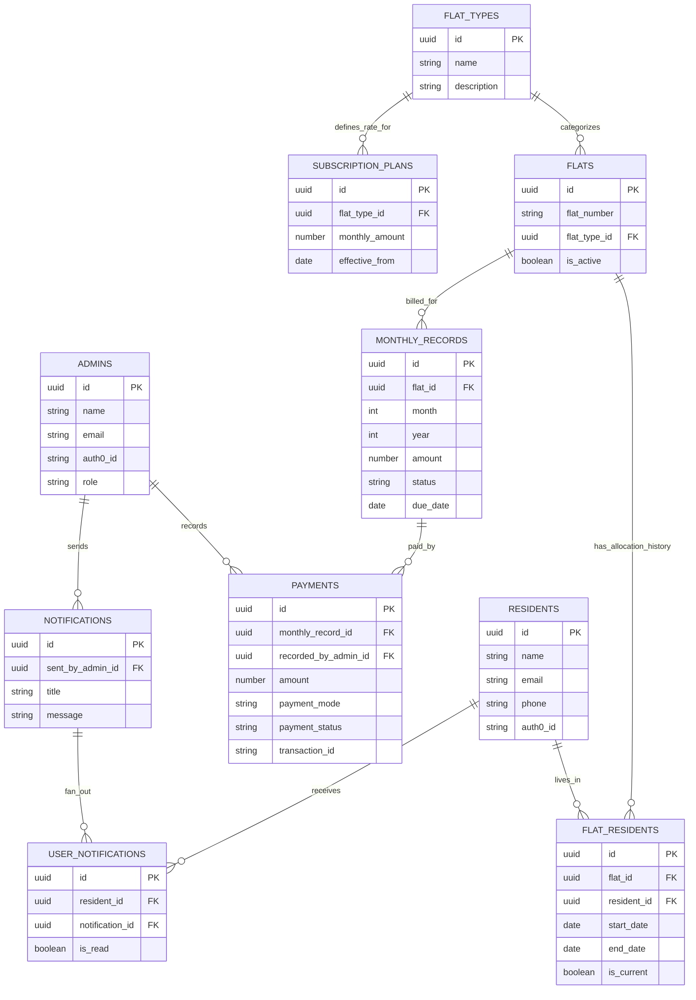

# Society Subscription Management - Project Flow Guide


## What This Project Does

This is a full-stack society maintenance/subscription management app.

- The `frontend` is a `Next.js` app.
- The `backend` is an `Express` app.
- The database is `PostgreSQL`.
- Authentication is handled with `Auth0`.
- Push notifications are handled with `OneSignal`.

There are 2 portals:

- `Admin portal` for managing residents, flats, plans, monthly records, payments, reports, and notifications.
- `Resident portal` for viewing dues, paying subscriptions, reading notifications, and updating profile details.

## High-Level Full Flow

The main app flow is:

1. User opens the landing page.
2. User chooses `Admin Portal` or `Resident Portal`.
3. Frontend sends the user to Auth0 login.
4. After login, Auth0 sends the user back to the frontend callback route.
5. Frontend stores the token in a cookie.
6. Protected pages use `RoleGuard` to check the logged-in role.
7. Frontend pages call backend APIs using `axios`.
8. Backend routes run auth middleware, validation, controller logic, and database queries.
9. Backend sends JSON response back.
10. Frontend updates tables, cards, forms, and messages.

Short version:

`UI -> frontend API client -> backend route -> middleware -> controller -> repository/service -> PostgreSQL/Auth0/OneSignal -> JSON response -> UI update`

## Project Structure

```text
project/
  backend/
    src/
      app.js
      server.js
      routes/
      controllers/
      repositories/
      services/
      middlewares/
      db/
      schemas/
    sql/
      schema.sql
      migrations/
  frontend/
    app/
      (admin)/
      (user)/
      api/auth/
    components/
    config/
    lib/
      api/
      utils/
      validation/
    providers/
```

## Shared Core Files

These files are used by many features, so they are not repeated every time below.

### Frontend Shared Core

- `frontend/package.json`
- `frontend/app/layout.js`
- `frontend/app/page.js`
- `frontend/app/(admin)/admin/layout.js`
- `frontend/app/(user)/user/layout.js`
- `frontend/config/env.js`
- `frontend/config/navigation.js`
- `frontend/lib/api/client.js`
- `frontend/lib/api/endpoints.js`
- `frontend/lib/api/error.js`
- `frontend/components/layout/PortalShell.js`
- `frontend/components/layout/Sidebar.js`
- `frontend/components/ui/ToastHost.js`
- `frontend/providers/ToastProvider.js`

### Backend Shared Core

- `backend/package.json`
- `backend/src/server.js`
- `backend/src/app.js`
- `backend/src/routes/index.js`
- `backend/src/middlewares/auth.middleware.js`
- `backend/src/middlewares/validate.middleware.js`
- `backend/src/middlewares/error.middleware.js`
- `backend/src/db/pool.js`
- `backend/src/db/query.js`
- `backend/src/utils/ApiResponse.js`
- `backend/src/utils/ApiError.js`
- `backend/src/utils/asyncHandler.js`
- `backend/sql/schema.sql`

## Database Tables

The database tables in `backend/sql/schema.sql` are:

- `admins` - stores admin users.
- `residents` - stores resident users.
- `flat_types` - stores flat categories like 1BHK, 2BHK.
- `flats` - stores flat numbers and type links.
- `flat_residents` - stores which resident is currently assigned to which flat.
- `subscription_plans` - stores monthly amount by flat type and effective date.
- `monthly_records` - stores monthly bills for each flat.
- `payments` - stores payment records.
- `notifications` - stores messages created by admin.
- `user_notifications` - stores which resident received which notification and read status.

## Recreate Roadmap From Scratch

Use this order if you want to rebuild the project on your own.

### 1. Create The Backend Base

Start with:

- `backend/package.json`
- `backend/src/server.js`
- `backend/src/app.js`

What to build:

- Create Express app.
- Add `cors`, JSON body parser, URL encoded parser, and cookies.
- Add route mounting with `API_PREFIX`.
- Start server only after DB connection works.


### 2. Add PostgreSQL Connection

Main files:

- `backend/src/db/pool.js`
- `backend/src/db/query.js`
- `backend/sql/schema.sql`
- `backend/sql/migrations/20260318_flat_allocation_single_user_role.sql`

What to build:

- Create `pg.Pool`.
- Read DB env values.
- Test DB connection with `SELECT 1`.
- Create tables from `schema.sql`.

Visual diagram:

```text
.env
   ->
pool.js
   ->
PostgreSQL connection
   ->
query.js
   ->
schema.sql tables
   ->
backend can read/write data
```

### 3. Add Authentication And Role Mapping

Main files:

- `backend/src/middlewares/auth.middleware.js`
- `backend/src/controllers/auth.controller.js`
- `frontend/app/api/auth/login/route.js`
- `frontend/app/api/auth/callback/route.js`
- `frontend/app/api/auth/logout/route.js`
- `frontend/app/api/auth/me/route.js`
- `frontend/components/auth/RoleGuard.js`

What to build:

- Auth0 login and callback.
- Save token in cookie.
- Backend JWT validation.
- Role mapping from DB, not only from token.
- Frontend route protection for admin and user pages.

Visual diagram:

```text
Login button
   ->
Auth0 login
   ->
callback route
   ->
token cookie
   ->
/api/auth/me
   ->
backend auth middleware
   ->
role check
   ->
protected page access
```

### 4. Create Database-First Repositories

Main files:

- `backend/src/repositories/resident.repository.js`
- `backend/src/repositories/flat.repository.js`
- `backend/src/repositories/allocation.repository.js`
- `backend/src/repositories/subscription.repository.js`
- `backend/src/repositories/payment.repository.js`
- `backend/src/repositories/notification.repository.js`
- `backend/src/repositories/user.repository.js`

What to build:

- Keep SQL in repository layer.
- Let controllers call repositories instead of writing SQL directly everywhere.

Visual diagram:

```text
Route
   ->
Controller
   ->
Repository
   ->
SQL query
   ->
PostgreSQL
   ->
Response
```

### 5. Build Admin Master Data Features

Build in this order:

1. Residents
2. Flat types
3. Flats
4. Allocation
5. Subscription plans

Reason:

- Residents and flats are the base data.
- Allocation connects residents and flats.
- Subscription plans depend on flat types.

Visual diagram:

```text
Residents
   + 
Flat Types
   ->
Flats
   ->
Allocation
   ->
Subscription Plans
   ->
base setup for billing
```

### 6. Build Monthly Billing Logic

Main files:

- `backend/src/services/monthly-record-auto-generation.service.js`
- `backend/src/controllers/admin/subscription.controller.js`
- `backend/src/controllers/admin/allocation.controller.js`

What to build:

- Generate monthly records for active allocations.
- Pick correct subscription amount based on flat type and date.
- Avoid duplicate monthly records.

Visual diagram:

```text
Active allocation
   ->
find flat type
   ->
find applicable plan
   ->
create monthly record
   ->
pending bill ready
```

### 7. Build Payment Logic

Main files:

- `backend/src/services/payment.service.js`
- `backend/src/controllers/admin/payment.controller.js`
- `backend/src/controllers/user/payment.controller.js`

What to build:

- Create payment entry.
- Mark monthly record as paid.
- Prevent duplicate completed payments.
- Return a simple receipt payload.

Visual diagram:

```text
Admin/User payment request
   ->
payment.service.js
   ->
find monthly record
   ->
create payment row
   ->
mark record paid
   ->
receipt response
```

### 8. Build Notifications

Main files:

- `backend/src/controllers/admin/notification.controller.js`
- `backend/src/services/push-notification.service.js`
- `frontend/components/notifications/UserPushRegistration.js`

What to build:

- Save notification in DB.
- Link notification to residents.
- Optionally send push notifications with OneSignal.

Visual diagram:

```text
Admin sends message
   ->
save notification
   ->
create user_notifications rows
   ->
optional OneSignal push
   ->
resident receives message
```

### 9. Build Frontend Shell

Main files:

- `frontend/app/layout.js`
- `frontend/app/(admin)/admin/layout.js`
- `frontend/app/(user)/user/layout.js`
- `frontend/components/layout/PortalShell.js`
- `frontend/components/layout/Sidebar.js`
- `frontend/config/navigation.js`

What to build:

- Shared layout.
- Sidebar navigation.
- Admin and user route groups.

Visual diagram:

```text
Root layout
   ->
Portal shell
   ->
Sidebar
   ->
Admin/User layouts
   ->
portal pages
```

### 10. Build Frontend API Layer

Main files:

- `frontend/lib/api/client.js`
- `frontend/lib/api/endpoints.js`
- `frontend/lib/api/admin.js`
- `frontend/lib/api/user.js`

What to build:

- One `axios` client.
- Central endpoint list.
- Small helper methods for admin and user API calls.

Visual diagram:

```text
Page component
   ->
adminApi / userApi
   ->
apiClient
   ->
backend endpoint
   ->
JSON response
```

### 11. Build Admin Pages

Build in this order:

1. Dashboard
2. Residents
3. Flats
4. Subscriptions
5. Monthly records
6. Payments
7. Reports
8. Notifications
9. Profile

Visual diagram:

```text
Admin layout
   ->
dashboard
   ->
master data pages
   ->
billing pages
   ->
reports
   ->
notifications
   ->
profile
```

### 12. Build User Pages

Build in this order:

1. Dashboard
2. Subscriptions
3. Pay now
4. Notifications
5. Profile

Visual diagram:

```text
User layout
   ->
dashboard
   ->
subscription history
   ->
pay now
   ->
notifications
   ->
profile
```

## Environment Setup

### Frontend

Use `frontend/.env.local.example` as reference.

Important frontend env values:

- `NEXT_PUBLIC_API_BASE_URL`
- `NEXT_PUBLIC_BASE_URL`
- `NEXT_PUBLIC_AUTH0_DOMAIN`
- `NEXT_PUBLIC_AUTH0_CLIENT_ID`
- `NEXT_PUBLIC_AUTH0_AUDIENCE`
- `NEXT_PUBLIC_AUTH0_USE_AUDIENCE`
- `AUTH0_CLIENT_SECRET`
- `AUTH0_ROLE_CLAIM`
- `NEXT_PUBLIC_ONESIGNAL_APP_ID`

### Backend

Backend reads these env values from code:

- `PORT`
- `NODE_ENV`
- `API_PREFIX`
- `DB_HOST`
- `DB_PORT`
- `DB_USER`
- `DB_PASSWORD`
- `DB_NAME`
- `DB_POOL_MAX`
- `DB_IDLE_TIMEOUT_MS`
- `DB_CONN_TIMEOUT_MS`
- `AUTH0_AUDIENCE`
- `AUTH0_FRONTEND_CLIENT_ID`
- `AUTH0_ISSUER_BASE_URL`
- `AUTH0_ROLE_CLAIM`
- `AUTH0_DOMAIN`
- `AUTH0_M2M_CLIENT_ID`
- `AUTH0_M2M_CLIENT_SECRET`
- `AUTH0_MANAGEMENT_AUDIENCE`
- `AUTH0_DB_CONNECTION`
- `PUSH_PROVIDER`
- `ONESIGNAL_APP_ID`
- `ONESIGNAL_API_KEY`

## Local Run Order

### Backend

```bash
cd backend
npm install
npm run dev
```

### Frontend

```bash
cd frontend
npm install
npm run dev
```

### Database

Create PostgreSQL DB and run the schema from:

- `backend/sql/schema.sql`

The backend starts only after the DB pool connection succeeds.

---

## Feature-Based Module Breakdown

### 1. Authentication And Portal Access

Frontend files:

- `frontend/app/page.js`
- `frontend/components/auth/PortalAccessButtons.js`
- `frontend/components/auth/RoleGuard.js`
- `frontend/app/api/auth/login/route.js`
- `frontend/app/api/auth/callback/route.js`
- `frontend/app/api/auth/logout/route.js`
- `frontend/app/api/auth/me/route.js`
- `frontend/app/(admin)/admin/layout.js`
- `frontend/app/(user)/user/layout.js`

Backend files:

- `backend/src/routes/index.js`
- `backend/src/controllers/auth.controller.js`
- `backend/src/middlewares/auth.middleware.js`

How it works:

The landing page shows 2 buttons: admin portal and resident portal. When a user clicks one, the frontend sends them to Auth0. After successful login, Auth0 sends the user back to the frontend callback route. The callback stores a token in a cookie. Protected pages use `RoleGuard` to confirm whether the logged-in user is an admin or a resident.

Data flow:

`Landing page -> /api/auth/login -> Auth0 -> /api/auth/callback -> token cookie -> /api/auth/me -> backend /auth/me -> role check -> admin/user page`

### 2. Admin Dashboard

Frontend files:

- `frontend/app/(admin)/admin/dashboard/page.js`
- `frontend/components/ui/DashboardCard.js`

Backend files:

- `backend/src/routes/admin.routes.js`
- `backend/src/controllers/admin/resident.controller.js`
- `backend/src/controllers/admin/flat.controller.js`
- `backend/src/controllers/admin/subscription.controller.js`
- `backend/src/controllers/admin/payment.controller.js`
- `backend/src/repositories/resident.repository.js`
- `backend/src/repositories/flat.repository.js`
- `backend/src/repositories/subscription.repository.js`
- `backend/src/repositories/payment.repository.js`
- `backend/src/services/monthly-record-auto-generation.service.js`

How it works:

The admin dashboard is not powered by one special dashboard API. Instead, the frontend calls multiple APIs for residents, flats, monthly records, and payments. Then it combines that data on the frontend and shows cards and charts.

Data flow:

`Admin dashboard page -> list residents + list flats + list monthly records + list payments -> backend controllers -> repositories -> PostgreSQL -> JSON responses -> frontend calculates totals and charts`

### 3. Resident Management

Frontend files:

- `frontend/app/(admin)/admin/residents/page.js`
- `frontend/components/ui/Modal.js`
- `frontend/components/ui/SkeletonTable.js`
- `frontend/lib/api/admin.js`
- `frontend/lib/validation/adminForms.js`

Backend files:

- `backend/src/routes/admin.routes.js`
- `backend/src/controllers/admin/resident.controller.js`
- `backend/src/repositories/resident.repository.js`
- `backend/src/services/auth0-management.service.js`
- `backend/src/schemas/resident.schema.js`

How it works:

Admin can create, edit, activate, and deactivate residents. When a new resident is created, the backend creates the user in Auth0 and also creates a row in the `residents` table. When a resident is deactivated, the backend can also close current flat allocation if needed.

Data flow:

`Residents page form/button -> /admin/residents or /admin/residents/:id -> resident controller -> resident repository + Auth0 management service -> PostgreSQL/Auth0 -> response -> table refresh`

### 4. Flat Types, Flats, And Allocation

Frontend files:

- `frontend/app/(admin)/admin/flats/page.js`
- `frontend/components/ui/Modal.js`
- `frontend/components/ui/SkeletonTable.js`
- `frontend/lib/api/admin.js`
- `frontend/lib/validation/adminForms.js`

Backend files:

- `backend/src/routes/admin.routes.js`
- `backend/src/controllers/admin/flat.controller.js`
- `backend/src/controllers/admin/allocation.controller.js`
- `backend/src/repositories/flat.repository.js`
- `backend/src/repositories/allocation.repository.js`
- `backend/src/repositories/resident.repository.js`
- `backend/src/repositories/subscription.repository.js`
- `backend/src/services/monthly-record-auto-generation.service.js`
- `backend/src/schemas/flat.schema.js`
- `backend/src/schemas/allocation.schema.js`

How it works:

Admin first creates flat types, then flats, then assigns a resident to a flat. The allocation is stored in `flat_residents`. When a new allocation is created, the backend also tries to generate monthly records up to the current month for that flat.

Data flow:

`Flats page -> create flat type / create flat / create allocation / end allocation -> flat or allocation controller -> repository/service -> PostgreSQL -> response -> updated flats list`

### 5. Subscription Plans

Frontend files:

- `frontend/app/(admin)/admin/subscriptions/page.js`
- `frontend/lib/api/admin.js`
- `frontend/lib/validation/adminForms.js`

Backend files:

- `backend/src/routes/admin.routes.js`
- `backend/src/controllers/admin/subscription.controller.js`
- `backend/src/repositories/subscription.repository.js`
- `backend/src/schemas/subscription.schema.js`

How it works:

Subscription plans define how much maintenance should be charged for each flat type. The app stores plan history using `effective_from`, so the amount can change over time without deleting older data.

Data flow:

`Subscriptions page -> /admin/subscription-plans -> subscription controller -> subscription repository -> subscription_plans table -> response -> current rate and history UI update`

### 6. Monthly Records

Frontend files:

- `frontend/app/(admin)/admin/monthly-records/page.js`
- `frontend/components/ui/Modal.js`
- `frontend/components/ui/SkeletonTable.js`
- `frontend/lib/api/admin.js`

Backend files:

- `backend/src/routes/admin.routes.js`
- `backend/src/controllers/admin/subscription.controller.js`
- `backend/src/controllers/admin/allocation.controller.js`
- `backend/src/repositories/subscription.repository.js`
- `backend/src/services/monthly-record-auto-generation.service.js`
- `backend/src/schemas/subscription.schema.js`

How it works:

Monthly records are the actual monthly bills. They are mainly generated from active flat allocations and subscription plans. Admin can view records by month and year. The backend also auto-generates missing records up to the current month when needed.

Data flow:

`Monthly records page -> /admin/monthly-records -> subscription controller -> ensure monthly records service -> subscription repository -> monthly_records table -> response -> records table`

### 7. Payments

Frontend files:

- `frontend/app/(admin)/admin/payments/page.js`
- `frontend/app/(admin)/admin/monthly-records/page.js`
- `frontend/app/(user)/user/pay-now/page.js`
- `frontend/app/(user)/user/subscriptions/page.js`
- `frontend/app/(user)/user/subscriptions/[month]/page.js`
- `frontend/lib/api/admin.js`
- `frontend/lib/api/user.js`
- `frontend/lib/utils/payments.js`
- `frontend/lib/utils/format.js`
- `frontend/lib/validation/adminForms.js`
- `frontend/lib/validation/userForms.js`
- `frontend/components/ui/Modal.js`
- `frontend/components/ui/SkeletonTable.js`

Backend files:

- `backend/src/routes/admin.routes.js`
- `backend/src/routes/user.routes.js`
- `backend/src/controllers/admin/payment.controller.js`
- `backend/src/controllers/user/payment.controller.js`
- `backend/src/services/payment.service.js`
- `backend/src/repositories/payment.repository.js`
- `backend/src/repositories/user.repository.js`
- `backend/src/schemas/payment.schema.js`

How it works:

Payments can happen in 2 ways. Admin can record a payment manually using `cash` or `upi`. Resident can pay from the user side, and that flow currently allows `razorpay`. The payment service checks the related monthly record, prevents duplicate completed payments, creates a payment row, marks the monthly record as paid, and returns receipt details.

Data flow:

`Payment form -> /admin/payments or /user/payments/pay -> payment controller -> payment service -> payment repository -> payments + monthly_records tables -> receipt response -> UI success message`

### 8. Reports

Frontend files:

- `frontend/app/(admin)/admin/reports/page.js`
- `frontend/components/ui/DashboardCard.js`
- `frontend/lib/api/admin.js`

Backend files:

- `backend/src/routes/admin.routes.js`
- `backend/src/controllers/admin/subscription.controller.js`
- `backend/src/controllers/admin/payment.controller.js`
- `backend/src/repositories/subscription.repository.js`
- `backend/src/repositories/payment.repository.js`

How it works:

Reports are mostly built on the frontend. The page loads monthly records and payments, calculates totals like billed amount, collected amount, pending amount, and payment mode breakdown, then lets admin download CSV and PDF files.

Data flow:

`Reports page -> list monthly records + list payments -> backend controllers -> repositories -> PostgreSQL -> response -> frontend calculates report -> CSV/PDF download`

### 9. Notifications And Push Notifications

Frontend files:

- `frontend/app/(admin)/admin/notifications/page.js`
- `frontend/app/(user)/user/notifications/page.js`
- `frontend/components/notifications/UserPushRegistration.js`
- `frontend/lib/api/admin.js`
- `frontend/lib/api/user.js`
- `frontend/lib/validation/adminForms.js`
- `frontend/public/OneSignalSDK.sw.js`
- `frontend/public/OneSignalSDKWorker.js`
- `frontend/public/OneSignalSDKUpdaterWorker.js`

Backend files:

- `backend/src/routes/admin.routes.js`
- `backend/src/routes/user.routes.js`
- `backend/src/controllers/admin/notification.controller.js`
- `backend/src/controllers/user/user.controller.js`
- `backend/src/repositories/notification.repository.js`
- `backend/src/repositories/user.repository.js`
- `backend/src/services/push-notification.service.js`
- `backend/src/schemas/notification.schema.js`
- `backend/src/schemas/user.schema.js`

How it works:

Admin can send a notification to one resident or many residents. The backend saves the notification, creates rows in `user_notifications`, and then tries to send push notifications using OneSignal. On the resident side, users can see their notifications and mark them as read.

Data flow:

`Admin notification form -> /admin/notifications -> notification controller -> notification repository + push service -> PostgreSQL/OneSignal -> response -> resident /user/notifications page shows message`

### 10. User Dashboard And Subscription History

Frontend files:

- `frontend/app/(user)/user/dashboard/page.js`
- `frontend/app/(user)/user/subscriptions/page.js`
- `frontend/app/(user)/user/subscriptions/[month]/page.js`
- `frontend/components/ui/DashboardCard.js`
- `frontend/components/ui/SkeletonTable.js`
- `frontend/lib/api/user.js`
- `frontend/lib/utils/payments.js`
- `frontend/lib/utils/format.js`

Backend files:

- `backend/src/routes/user.routes.js`
- `backend/src/controllers/user/user.controller.js`
- `backend/src/repositories/user.repository.js`
- `backend/src/services/monthly-record-auto-generation.service.js`

How it works:

The resident dashboard shows pending records, paid records, pending amount, unread notifications, and recent payments. The subscriptions pages show all monthly bills and merge them with payment data so the resident can see payment mode, status, and receipt-style details.

Data flow:

`User dashboard/subscriptions page -> /user/dashboard + /user/monthly-records + /user/payments -> user controller -> ensure monthly records service + user repository -> PostgreSQL -> response -> frontend merges records with payments`

### 11. User Profile And Password

Frontend files:

- `frontend/app/(user)/user/profile/page.js`
- `frontend/app/(admin)/admin/profile/page.js`
- `frontend/lib/api/user.js`
- `frontend/lib/api/client.js`
- `frontend/lib/api/endpoints.js`
- `frontend/lib/validation/userForms.js`

Backend files:

- `backend/src/routes/index.js`
- `backend/src/routes/user.routes.js`
- `backend/src/controllers/auth.controller.js`
- `backend/src/controllers/user/user.controller.js`
- `backend/src/repositories/user.repository.js`
- `backend/src/services/auth0-management.service.js`
- `backend/src/schemas/user.schema.js`

How it works:

Resident profile page lets the user update phone number and change password. Password change is handled through Auth0 management APIs. Admin profile page is simpler and only shows the logged-in Auth0 profile/role information.

Data flow:

`Profile page -> /user/profile or /user/profile/password -> user controller -> user repository or Auth0 management service -> PostgreSQL/Auth0 -> response -> updated profile UI`

## Interview-Friendly Story To Explain The App

You can explain the project like this:

1. This is a full-stack society subscription app with separate admin and resident portals.
2. The frontend is built with Next.js and the backend is built with Express.
3. Auth0 handles login, but actual access is decided by backend role mapping from the database.
4. Admin manages residents, flats, flat allocation, subscription plans, monthly records, payments, reports, and notifications.
5. Resident sees dashboard data, subscription history, can pay dues, check notifications, and update profile.
6. PostgreSQL stores the core business data.
7. The backend mostly follows this pattern: route -> auth -> validation -> controller -> repository/service -> database -> response.
8. The frontend mostly follows this pattern: page -> API helper -> backend -> response -> local React state update.

## Interview Notes

### 1-Minute Project Summary

This project is a society subscription management system with 2 portals: admin and resident. The frontend is built with Next.js, the backend is built with Express, and PostgreSQL stores the business data. Auth0 is used for login, but the backend still checks the database to decide whether the user is really an admin or resident. Admin manages residents, flats, plans, bills, payments, reports, and notifications. Residents can view dues, pay, read notifications, and update profile details.

### Simple Architecture Line

Use this line in interview:

`Next.js frontend -> Express backend -> PostgreSQL database -> Auth0 for login -> OneSignal for push notifications`

### Important Backend Flow To Remember

Use this line in interview:

`Route -> auth middleware -> validation -> controller -> repository/service -> database -> JSON response`

### Important Frontend Flow To Remember

Use this line in interview:

`Page -> API helper -> backend API -> response -> React state update -> UI refresh`

### Feature Build Order To Say In Interview

If they ask how you would rebuild it:

1. Backend server setup
2. DB connection and schema
3. Auth and role mapping
4. Shared frontend shell
5. Residents
6. Flats and allocation
7. Subscription plans
8. Monthly records
9. Payments
10. Notifications
11. Reports
12. User profile and self-service pages

### Tables To Remember

The most important tables to remember are:

- `residents`
- `flats`
- `flat_residents`
- `subscription_plans`
- `monthly_records`
- `payments`
- `notifications`
- `user_notifications`

### Easy Way To Explain Billing Logic

You can say:

The billing starts when a resident is allocated to a flat. The system checks the flat type, finds the correct subscription plan for that date, and creates monthly records. When a payment happens, a payment row is created and the monthly record status becomes `paid`.

### Easy Way To Explain Auth Logic

You can say:

The frontend handles login redirection through Auth0 and stores the token in a cookie. Then protected pages call the auth check route. The backend validates the token and also checks the database mapping, because token login alone is not enough to give access.

### Common Interview Questions And Short Answers

`Why use repositories?`
Because SQL stays organized in one place and controllers stay cleaner.

`Why keep monthly_records separate from payments?`
Because a bill and a payment are different things. A monthly record shows what is due, and payment shows how it was paid.

`Why use flat_residents?`
Because residents can change flats over time, so allocation history needs its own table.

`Why use effective_from in subscription_plans?`
Because charges can change in future, and old billing history should still remain correct.

`Why is role mapping checked in DB also?`
Because login proves identity, but the database decides what the user is allowed to access in this app.

### Why We Used `zod`

This project uses `zod` for validation on both frontend and backend.

Where it is used:

- Frontend form validation in files like `frontend/lib/validation/adminForms.js`
- Backend request validation in files like `backend/src/schemas/*.js`
- Backend middleware in `backend/src/middlewares/validate.middleware.js`

Why it is useful here:

- It keeps validation rules in one clean place.
- It gives readable error messages.
- It validates request `body`, `params`, and `query` in one structure.
- It can also transform values, like converting page and limit from string to number.
- It reduces repeated `if/else` checks in controllers and UI forms.

Simple example from this project:

- `flat_type_id` must be a valid UUID.
- `page` and `limit` are converted to numbers.
- `month` must be between `1` and `12`.
- password fields must follow strong password rules.

### What Happens If We Do Not Use `zod`

If we do not use `zod`, then validation has to be written manually.

That usually causes these problems:

- More repeated code in many files
- Easier to forget checks
- Controllers become messy
- Error messages become inconsistent
- Type conversion becomes harder to manage
- Frontend and backend may validate differently

Example problem:

If the client sends:

- empty `flat_number`
- invalid `flat_type_id`
- `page=abc`

without validation, bad data can move deeper into the app and cause:

- SQL errors
- wrong filtering
- broken business logic
- confusing API responses

### How We Would Implement Validation Natively

If we wanted to do it without `zod`, we could write manual checks using plain JavaScript.

Backend native example idea:

```js
const errors = [];

if (!req.body.flat_number || req.body.flat_number.trim().length === 0) {
  errors.push({ path: "flat_number", message: "Flat number is required" });
}

if (!req.body.flat_type_id || !isUuid(req.body.flat_type_id)) {
  errors.push({ path: "flat_type_id", message: "Flat type id must be valid" });
}

const page = Number(req.query.page || 1);
if (!Number.isInteger(page) || page < 1) {
  errors.push({ path: "page", message: "Page must be a positive integer" });
}

if (errors.length) {
  return res.status(400).json({ message: "Validation error", errors });
}
```

Frontend native example idea:

```js
const errors = {};

if (!values.email) {
  errors.email = "Email is required";
} else if (!values.email.includes("@")) {
  errors.email = "Email is invalid";
}

if (!values.phone || values.phone.length !== 10) {
  errors.phone = "Phone number must be exactly 10 digits";
}
```

This works, but it becomes long and repetitive as the project grows.

### Which One Is More Complex?

Native validation is more complex in a medium or large project.

Why native becomes harder:

- You write more boilerplate code
- You repeat the same rules in many places
- It is harder to reuse rules
- It is harder to keep backend and frontend behavior aligned
- Nested validation and custom rules become harder to maintain

For a very small form, native validation is okay.

For this project, `zod` is the simpler and cleaner choice.

### How `zod` Helps In This Project Specifically

On the backend:

- `validate.middleware.js` uses `schema.safeParse(...)`
- if validation fails, the app returns a structured `400` error
- if validation passes, cleaned data is stored in `req.validated`

On the frontend:

- `react-hook-form` and `zod` work together
- forms show field-level errors before sending bad data
- password, UUID, month/year, and required field checks stay centralized

### Other Libraries That Do Similar Work

Other libraries that can be used instead of `zod` are:

- `Joi`
- `Yup`
- `Ajv`
- `class-validator`
- `express-validator`
- `superstruct`
- `valibot`

Quick comparison:

- `Joi`: very popular for backend validation, but less commonly shared across frontend and backend.
- `Yup`: common in frontend forms, especially older React projects.
- `Ajv`: powerful for JSON Schema based validation, but can feel heavier.
- `express-validator`: useful in Express apps, but validation rules stay closer to routes instead of reusable schema objects.
- `valibot`: modern and lightweight, somewhat similar in style to `zod`.

### Best Interview Answer For `zod`

You can say:

We used `zod` to keep validation centralized, reusable, and consistent across the project. It helped us validate request data on the backend and form data on the frontend with readable schemas. Without it, we would need many manual checks, which would make the code longer, more error-prone, and harder to maintain.

### Final Revision Tip

Before interview, practice explaining the app in this order:

`login -> role check -> master data -> allocation -> monthly bill generation -> payment -> notifications -> reports`

## Architecture Diagram

Use this when you want to explain the whole app visually.



### Short Diagram Explanation

- Browser uses the Next.js frontend.
- Frontend handles login redirect and callback with Auth0.
- Frontend pages call backend APIs using the shared API client.
- Backend runs middleware, then controllers.
- Controllers use repositories for DB work and services for business logic or external APIs.
- Backend responds with JSON and frontend updates the screen.

## Database Relationship Diagram

Use this when you want to explain how the tables are connected.



### Easy DB Story

You can explain the database like this:

- `flat_types` stores the type of flat.
- `flats` stores actual flats.
- `flat_residents` connects a resident to a flat and keeps history.
- `subscription_plans` stores the amount by flat type.
- `monthly_records` stores the monthly bill for a flat.
- `payments` stores how that bill was paid.
- `notifications` stores admin messages.
- `user_notifications` stores which resident received which message.

## Mock Interview Q&A

### Q1. What problem does this project solve?

It helps a housing society manage monthly subscription or maintenance billing. Admin can manage residents, flats, plans, bills, payments, and notifications. Residents can see their dues, payment history, and notifications.

### Q2. Why did you split the app into admin and resident portals?

Because both users have different responsibilities. Admin manages data and billing operations. Resident mainly views and pays their own records. Separate portals make access control and UI cleaner.

### Q3. What is the frontend stack here?

The frontend uses Next.js App Router, React, local component state, shared API helper files, and form validation with `react-hook-form` and `zod`.

### Q4. What is the backend stack here?

The backend uses Express, PostgreSQL, raw SQL repositories, middleware for auth and validation, and service files for payment logic, Auth0 management, and notifications.

### Q5. How does authentication work?

The frontend redirects the user to Auth0. After login, Auth0 sends the user back to the callback route, and the frontend stores a token in a cookie. Protected pages call the auth check route, and the backend validates the token and maps the user to a DB role.

### Q6. Why is database role mapping important if Auth0 already authenticates the user?

Because authentication only proves who the user is. Authorization decides what they can access in this app. This project uses the database to decide whether the authenticated user is an admin or resident.

### Q7. How are monthly bills generated?

Monthly bills are generated from active flat allocations. The backend checks which resident is currently assigned to which flat, finds the correct subscription plan for that flat type and date, and creates a `monthly_record`.

### Q8. Why do you need both `monthly_records` and `payments` tables?

Because they represent different things. `monthly_records` tells what is due. `payments` tells how and when it was paid. This separation makes billing history clearer.

### Q9. How does the payment flow work?

The UI sends a payment request to the backend. The payment service checks whether the monthly record exists and is still pending. Then it creates a payment row, marks the monthly record as paid, and returns receipt data.

### Q10. What happens when a resident is allocated to a flat?

The app creates an entry in `flat_residents`. After that, the backend can generate monthly records for that flat from the allocation start date up to the current month.

### Q11. Why store `effective_from` in subscription plans?

Because rates can change over time. `effective_from` helps the app pick the correct plan for a given month without breaking old billing history.

### Q12. How are notifications handled?

Admin creates a notification, the backend stores it in `notifications`, then creates resident-specific rows in `user_notifications`. If OneSignal is configured, it also sends push notifications.

### Q13. What pattern does the backend follow for most APIs?

Most APIs follow:

`route -> auth middleware -> validation -> controller -> repository/service -> database -> response`

### Q14. What pattern does the frontend follow for most screens?

Most screens follow:

`page -> API helper -> backend endpoint -> response -> React state update -> UI`

### Q15. If you had to rebuild this app from scratch, what order would you follow?

I would first build backend setup and DB connection, then authentication, then shared frontend shell and API client, then master data modules like residents and flats, then allocation, subscription plans, monthly records, payments, notifications, reports, and finally the user self-service pages.

### Q16. What are the most important entities to remember for interview explanation?

The most important entities are `residents`, `flats`, `flat_residents`, `subscription_plans`, `monthly_records`, `payments`, `notifications`, and `user_notifications`.

### Q17. What would you improve in the future?

I would improve this project by adding stronger test coverage, better API documentation, pagination/filter reuse, maybe React Query for frontend data fetching, and a real payment gateway integration flow instead of a simplified payment simulation.

## Best Order To Practice Rebuilding

If you want to rebuild this project for interview practice, follow this exact order:

1. Backend server and DB connection
2. Database schema
3. Auth0 login and role guard
4. Shared frontend shell and API client
5. Residents module
6. Flats and allocation module
7. Subscription plans
8. Monthly record generation
9. Payments
10. User dashboard and subscription history
11. Notifications
12. Reports
13. Profile pages

That order makes the project easier to understand because every later feature depends on the earlier data setup.
